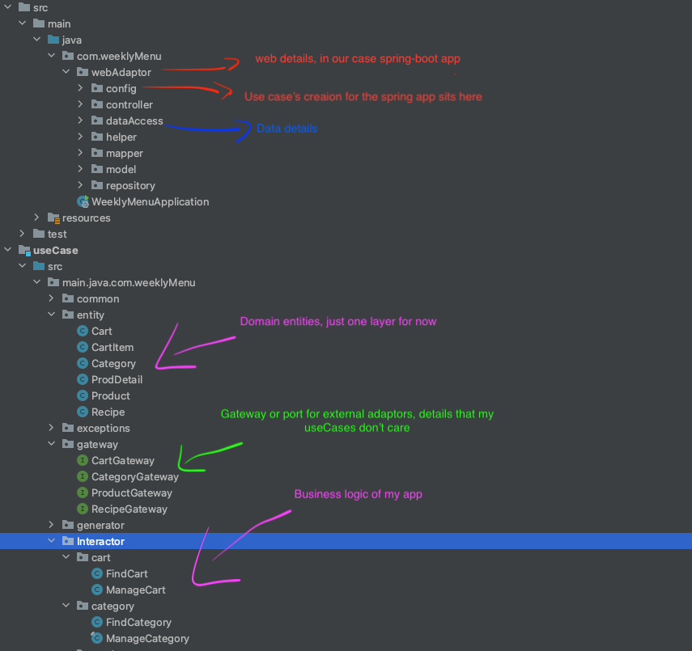

# Weekly Menu Server

 

 

  <h3 align="center">Weekly Menu</h3>

  

    It's a web application to make the shopping list from recipes.
     
     
  

<!-- TABLE OF CONTENTS -->

  
Table of Contents

  <ol>
    <li>
      <a href="#about-the-project">About The Project</a>
      <ul>
        <li><a href="#built-with">Built With</a></li>
      </ul>
    </li>
    <li>
        <a href="#architecture">Architecture</a>
        <ul>
          <li><a href="#components-boundaries">Components boundaries</a></li>
          <li><a href="#file-structure">File Structure</a></li>
          <li><a href="#useCases">UseCases</a></li>
          <li><a href="#ds-input-output">Ds Input Output</a></li>
        </ul>
    </li>
  </ol>

## About the project

This app is not just a shopping list app, it generates a list of products based on your weekly menu, 
so you don't need to worry about on what product goes into your list, 
the app takes care of it and generates for you based on the recipe's product,
(See [UI](https://github.com/eliasjunior/weekly-menu-react))

### Built With
* [Spring Boot](https://spring.io/projects/spring-boot) 
* [Clean architecture approach](https://blog.cleancoder.com/uncle-bob/2012/08/13/the-clean-architecture.html) 

Front-end [React UI](https://github.com/eliasjunior/weekly-menu-react)

### Architecture

    

Software architecture is one of my favorites topics and putting theory and practice together is challenging but also fun,
and when it comes to software engineering. Robert C. Martin (aka Uncle Bob) has developed his vision of a
clean architecture in his book, that I highly recommend.

### Components boundaries

    

### File structure

    

### UseCases

In order simplify the development I've chosen to not create the domain/entities module for this first stage,
as the code evolves I can come back and rethink  to add more layers as it need, the domain/entities are in the useCase module

### Ds Input Output

Data structure output and input are not implemented yet, for now I'm just passing the entities(domain) for simplicity

    
